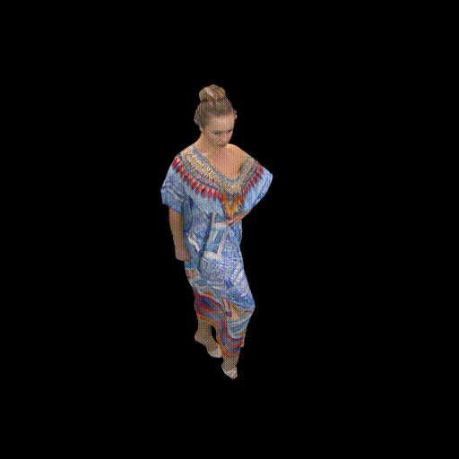

# Dynamic-LapisGS

The extension of LapisGS to Dynamic 3DGS. 

The rendering results of the dynamic scene *longdress* from 8i dataset with different resolutions are shown below.

<table>
  <tr>
    <td align="center">
      <br>
      <sub>Scaling ×1</sub>
    </td>
    <td align="center">
      <br>
      <sub>Scaling ×2</sub>
    </td>
    <td align="center">
      <br>
      <sub>Scaling ×4</sub>
    </td>
    <td align="center">
      <br>
      <sub>Scaling ×8</sub>
    </td>
  </tr>
</table>

## Background

The Dynamic-LapisGS serves as the foundation of our dynamic 3DGS streaming system, "LTS: A DASH Streaming System for Dynamic Multi-Layer 3D Gaussian Splatting Scenes", which won the 🏆**Best Paper Award**🏆 at ACM MMSys'25 in April. See the [paper](https://drive.google.com/file/d/1iDz1ExOd1LrPhA7fv4DbLUbzn-Jioihn/view?usp=share_link). 

### Idea Overview

D-LapisGS builds upon [LapisGS](https://yuang-ian.github.io/lapisgs/) and [Dynamic-3DG](https://dynamic3dgaussians.github.io). The training consists of two main components: multi-resolution training and temporal coherence maintenance:
1. **For the first frame** of the dynamic sequence: like LapisGS, D-LapisGS initially trains a low-resolution base layer, followed by successive enhancement layers utilizing higher-resolution datasets.
2. **For the subsequent frames**: to maintain temporal coherence, D-LapisGS treats Gaussians as particles governed by physical constraints, including local rigidity, rotational similarity, and long-term local isometry. That is:
   1. For each subsequent frames, we don't explicitly train a LapisGS from scratch. Instead, the Gaussians of base layer and enhancement layers are inherited from the previous frame.
   2. They are optimized only on the rotation and position parameters, while keeping the other parameters (e.g., color, scaling) fixed.


### LTS System Code Availability

As for the code of LTS system, however, we have received notice from a company asserting that portions of our work may overlap with their patents related to viewport-dependent streaming. We are currently addressing this issue. At this moment, **we CANNOT make the system code or scripts openly available**. We apologize for any inconvenience that may cause and appreciate your understanding. 

Nevertheless, **we firmly believe in the importance of open research and collaboration,** and we remain actively open to technical discussions and are strongly willing to provide clarifications regarding the implementation through academic or professional exchange.

Luckily, the core code for Dynamic-LapisGS is still available. You can use it to train and render your own dynamic 3DGS models. See below 👇!


## Setup

The code is built on the codebase of [LapisGS](https://github.com/nus-vv-streams/lapis-gs?tab=readme-ov-file), which essentially only modifies a few lines of code to support dynamic 3DGS. Please refer to the LapisGS repository for detailed requirements and elaboration.

## Pre-processing


### Dataset Preparation

The first step is to generate the multi-resolution dynamic data for the training part. 

In our paper, we generate multi-resolution data by rendering the original point cloud data from [8i dataset](https://plenodb.jpeg.org/pc/8ilabs) with different image resolutions. Specifically, we downsample the original data by factors of 2×, 4×, and 8×, to have 4 levels of resolution. 

We provide a script to generate multi-resolution data for 2 dynamic scenes from 8i dataset we used in the paper: Long Dress and Soldier, where 
1. For each dynamic scene, we generate image dataset for 30 frames (the number of frames can be set with the `--total_frame_num` argument, 30 by default). 
2. For each frame, we generate 100 random views for training and another 200 random views for testing with the same camera settings of [NeRF](https://www.matthewtancik.com/nerf). To save your time, the camera setting files are attached, i.e., `transforms_train.json` and `transforms_test.json`.

You can run the script with the following command:

```bash
python dataset_prepare.py --ptcl_root <Path to the root directory of point clouds> --output_root <path to the output dataset root directory> --total_frame_num <number of frames to process for each model, 30 by default> --dataset_name <name of the dataset, 8i by default> 
```


### Dataset Structure

For example, we can generate the dataset hierarchy of dataset 8i with the following command:

```bash
python dataset_prepare.py --ptcl_root ./raw_dataset/8iVFBv2 --output_root ./source --total_frame_num 30 --dataset_name 8i
```

You should have the following file structure for the model training:

```
project
└── raw_dataset # source_base
    ├── 8iVFBv2 # dataset_name
    │   └── longdress # dynamic scene
    │       └── Ply
    │           ├── longdress_vox10_1051.ply
    │           ├── longdress_vox10_1052.ply
    │           └── ...
    │   └── soldier # dynamic scene
    │       └── Ply
    │           ├── soldier_vox10_0536.ply
    │           ├── soldier_vox10_0537.ply
    │           └── ...
└── source # output_base
    ├── 8i # dataset_name
    │   └── longdress # scene
    │       └── longdress_res1
    │           ├── 1051
    │               ├── train
    │               ├── test
    │               ├── transforms_test.json
    │               └── transforms_train.json
    │           ├── 1052
    │           ...
    │       └── longdress_res2
    │           ├── 1051
    │               ├── train
    │               ├── test
    │               ├── transforms_test.json
    │               └── transforms_train.json
    │           ├── 1052
    │           ...
    │       └── longdress_res4
    │           ├── 1051
    │               ├── train
    │               ├── test
    │               ├── transforms_test.json
    │               └── transforms_train.json
    │           ├── 1052
    │           ...
    │       └── longdress_res8
    │           ├── 1051
    │               ├── train
    │               ├── test
    │               ├── transforms_test.json
    │               └── transforms_train.json
    │           ├── 1052
    │           ...
```


## Running

```bash
python train_full_pipeline.py --model_base <path to the output model root directory> --dataset_base <path to the source root directory> --dataset_name <name of the dataset> --scene <name of the scene> --method <name of the method>  --frame_list <two numbers separated by space, indicating the start and end frame index, e.g., 0 30>
```

<details>
<summary><span style="font-weight: bold;">Please click here to see the arguments for the `train_full_pipeline.py` script.</span></summary>

| Parameter | Type | Description |
| :-------: | :--: | :---------: |
| `--model_base`   | `str` | Path to the output model root directory.|
| `--dataset_base` | `str` | Path to the source root directory. |
| `--dataset_name` | `str` | Name of the dataset of scenes. |
| `--scene`        | `str` | Name of the scene. |
| `--method`       | `str` | Name of the method we build the LOD 3DGS. Can be `"dynamic-lapis"` (the proposed method). |
| `--frame_list`   | `str` | Two numbers separated by space, indicating the start and end frame index, e.g., `0 30`. |

</details>
<br>

For example, we train the model for the scene *longdress* from dataset *8i* with the proposed method *dynamic-lapis*, using the command:
```bash
python train_full_pipeline.py --model_base ./model --dataset_base ./source --dataset_name 8i --scene longdress --method dynamic-lapis --frame_list 1051 1080
```

The file structure after training should be as follows:
```
project
└── source # dataset_base
    ├── 8i # dataset_name
    │   └── longdress # scene
    │       └── longdress_res1
    │           ├── 1051
    │           ├── 1052
    │           ├── 1053
    │           ...
    │       ├── longdress_res2
    │       ├── longdress_res4
    │       └── longdress_res8
└── model # model_base
    ├── 8i # dataset_name
    │   └── longdress # scene
    │       └── dynamic-lapis # method
    │           └── longdress_res1
    |               ├── 1051
    │               ├── dynamic_1052
    │               ├── dynamic_1053
    │               ...
    │               └── dynamic_1080
    │           ├── longdress_res2
    │           ├── longdress_res4
    │           └── longdress_res8
```


### Evaluation

We use the following command to evaluate the model:
```bash
python render.py -m <path to trained model> # Generate renderings
python metrics.py -m <path to trained model> # Compute error metrics on renderings
```

## Citation

If you find our code or paper useful, please cite:

```
@inproceedings{sun2025lts,
  author       = {Yuan{-}Chun Sun and
                  Yuang Shi and
                  Cheng{-}Tse Lee and
                  Mufeng Zhu and
                  Wei Tsang Ooi and
                  Yao Liu and
                  Chun{-}Ying Huang and
                  Cheng{-}Hsin Hsu},
  title        = {{LTS:} {A} {DASH} Streaming System for Dynamic Multi-Layer {3D} {Gaussian}
                  Splatting Scenes},
  booktitle    = {Proceedings of the 16th {ACM} Multimedia Systems Conference, MMSys
                  2025, Stellenbosch, South Africa, 31 March 2025 - 4 April 2025},
  pages        = {136--147},
  publisher    = {{ACM}},
  year         = {2025},
  url          = {https://doi.org/10.1145/3712676.3714445},
  doi          = {10.1145/3712676.3714445},
}
```